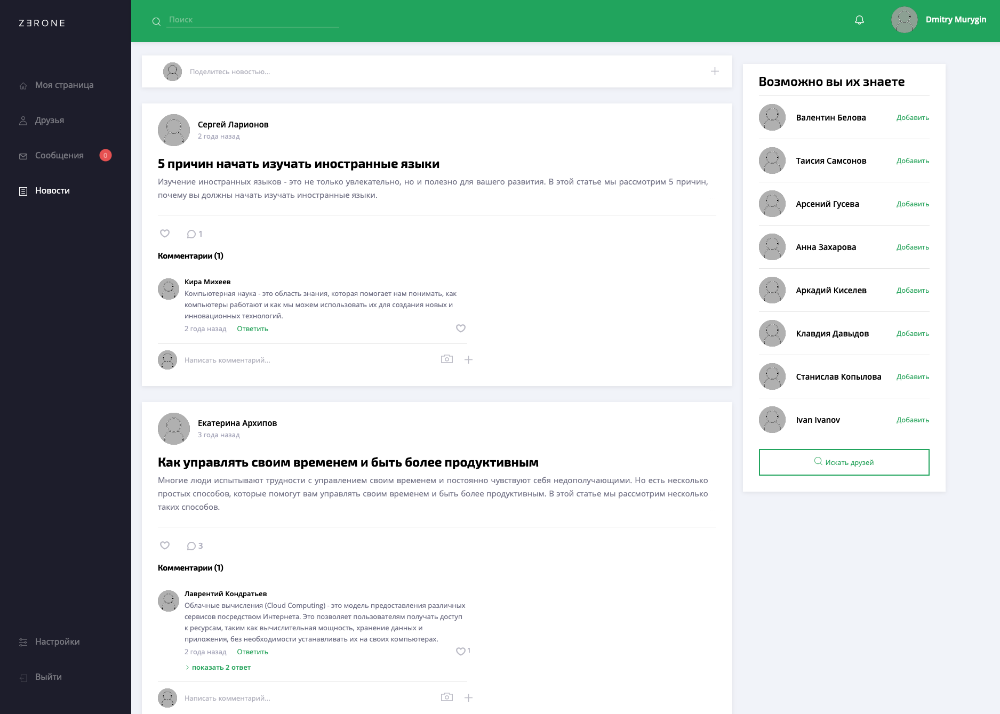

<h2><a href="http://zerone-net.ru">Zerone Network</a></h2>

<h4>Welcome to Zerone, a social networking platform created by a group of seven developers using the Scram methodology. Zerone Network is designed to transform the way we connect and interact online, offering a rich set of features for a seamless and enjoyable social media experience.</h4>

<h3>Key Features</h2>

- <b>Enhanced User Profiles:</b> Create user profiles, complete with personal information, profile photos, alerts settings, and an intuitive address-filling assistant for a smoother registration process.
- <b>Secure Privacy Settings:</b> Protect your account with robust security measures. Easily change your account password and email, ensuring your information remains confidential.
- <b>Content Sharing:</b> Share your thoughts, news, photos, articles, and engaging comments with your friends and connections. Express appreciation for posts through the "like" feature, fostering a positive and supportive community.
- <b>Socialization:</b> Build meaningful connections by adding friends to your network. Take control of your social circle by utilizing the blacklist feature.
- <b>Real-Time Messaging:</b> Stay connected with your contacts through instant messaging using WebSocket technology. Experience real-time communication without any delays.
- <b>Moderation panel:</b> Moderate comments, posts or even user avatars.

<h3>Technology Stack</h2>
<h4>ConnectHub is built on a solid foundation of modern and reliable technologies</h4>

- <b>Spring Boot 3.0.6:</b> Security, Data, Cloud, Web, AOP, Test
- <b>Postgres:</b> A reliable and efficient PostgreSQL database for data storage and management.
- <b>Docker:</b> Containerize the application for easier deployment and scalability.
- <b>Logback:</b> A high-performance logging framework for effective log management.
- <b>Redis:</b> Utilizing Redis as an in-memory data structure store to enhance performance and caching.
- <b>Websocket:</b> Employing WebSocket technology to enable real-time messaging for seamless communication.
- <b>Jooq:</b> An efficient library for database access.
- <b>Kafka:</b> Utilizing Kafka for scalable and distributed event streaming.
- <b>Thymeleaf:</b> A robust templating engine for server-side rendering.
- <b>Swagger:</b> An API documentation tool to facilitate seamless interaction with the API.
- <b>External API Integration:</b> Connecting with various external APIs, such as GDrive, Cloudinary, VK, and dadata, to enrich user experience and functionality.
- <b>Testcontainers:</b> Ensuring reliable and reproducible testing using containerization.
- <b>Monitoring (Prometheus, Grafana):</b> Keeping track of system metrics and health for performance optimization.
- <b>GitHub Actions (CI/CD):</b> Automating continuous integration and deployment to streamline the development process.
- <b>Sonar</b>: Static code analyser improves code quality

<h3>Microservice Architecture</h2>
<h4>ConnectHub follows a microservice architecture to ensure modularity and scalability</h4>

- <b>Frontend:</b> Handles the user interface and user interactions.
- <b>Backend:</b> Manages core business logic and data processing.
- <b>Admin Panel:</b> Offers an intuitive interface for administrative tasks.
- <b>Api-gateway, Eureka:</b> Facilitates API communication and service discovery.
- <b>Mail Service:</b> Handles email notifications and communication.
- <b>Grafana:</b> Enables monitoring and visualization of system metrics.

<h3>Additional Libraries</h2>
<h4>In addition to the powerful technology stack, ConnectHub utilizes the following libraries for enhanced functionality</h4>

- <b><a href="https://github.com/ulisesbocchio/jasypt-spring-boot">Jasypt Spring Boot:</a></b> Ensures secure encryption and decryption of sensitive data.
- <b><a href="https://www.bouncycastle.org/java.html">Bouncy Castle:</a></b> Provides cryptographic services to bolster security measures.
- <b><a href="https://mapstruct.org">MapStruct:</a></b> Simplifies Java bean mappings for efficient data manipulation.
- <b><a href="https://github.com/mrniko/netty-socketio">Netty Socket.IO:</a></b> Facilitates WebSocket communication for real-time messaging.
- <b><a href="https://sonarcloud.io/project/overview?id=Muryginds_SocialNetwork">Sonarcloud.io:</a></b> Static code analyser.
